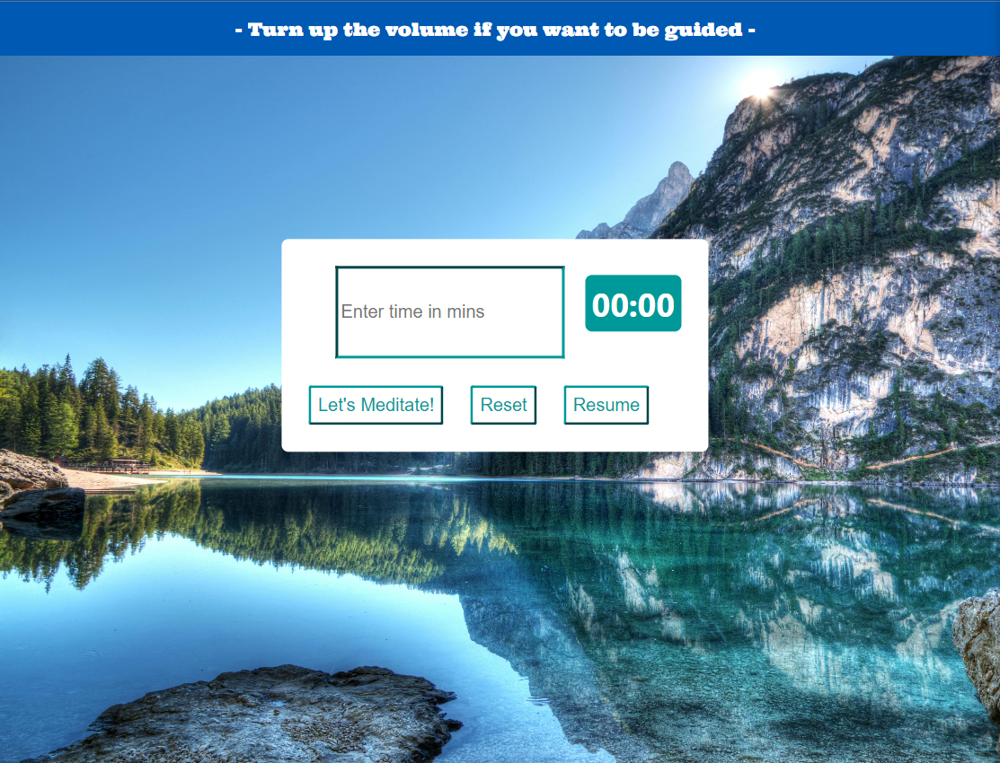

# Meditation-guide




</br>


> This is a meditatino app that gives you a timer and a guide that follow you during the meditation!
---

### Table of Contents

- [Description](#description)
- [How To Use](#how-to-use)
- [Author Info](#author-info)

---

## Description

The project involved creating a meditation app using React and some hooks that can give you a personal timer for a meditation session and an audio guide that follow you during the breathing. 

#### Technologies

- HTML  
- CSS
- Javascript
- React
- Visual Studio Code


[Back To The Top](#Meditation-guide)

---

## How To Use

The use is quite simple, there are 3 buttons: 
- The first button with the frase "Let's Meditate!" start the timer, if you enter for example 5 as the minutes that you want to meditate and as soon as you click it the count down start and with it the audio guide start. 
- The second one as you can imagine :) reset the timer and with it the audio guide. 
- The third one as soon as you click to start meditate will be appear as pause and will pause both the timer and the audio guide, after that will appear the word resume and if you click it again allows you to re-start both.


#### API Reference
- Little example of one of the consts that I used.

```javascript
    const start = () => {
    const minutes = parseInt(inputElement.current.value, 10);
    if (!isNaN(minutes) && minutes > 0) {
      setCounter(minutes * 60);
      setTimerRunning(true);
      startAudio();
    }
  };
```
[Back To The Top](#Meditation-guide)

---


## Author Info
I wll see you on my social media!

- Twitter - [@GabrielValorianiFranco](https://twitter.com/GabrielValoria)
- Linkedin - [GabrielValoriani](https://www.linkedin.com/in/gabriel-valoriani-franco-9971a3291/)

[Back To The Top](#Meditation-guide)